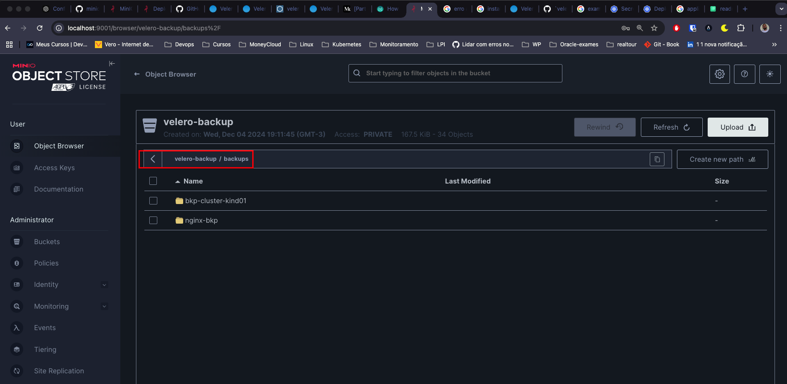

# Como fazer backup de recursos no kubernetes utilizando a ferramenta Velero
Neste repositório vamos ver como fazer backup de recursos de um cluster kuberntes para um repositório remoto, neste caso iremos utilizar o MinIo Server e restaurar o backup em um novo cluster kubernetes.

# MinIO Server
Para facilitar iremos utilizar o servidor do minio no docker, dentro da pasta minio-server execute o comando para subir o servidor:
```bash
docker compose up -d
```
Feito isto seu servidor ja estará acessível na porta **9001**

Logue no seu MinIo Server e crie uma **access key** para ser usada na configuração do velero

# Instalação do client minio
Caso queira interagir com o seu servidor via linha de comando, temos a  opção de instalar o cli do minio

```bash
wget https://dl.min.io/client/mc/release/linux-amd64/mc
chmod +x mc
sudo mv mc /usr/local/bin/mc    
```

# Instalacão do Velero CLI

Faça o download da versão desejada descompacte e mova para o seu $PATH (/usr/local/bin)

[Velero v1.15.0](https://github.com/vmware-tanzu/velero/releases/download/v1.15.0/velero-v1.15.0-linux-amd64.tar.gz)

# Instalação do velero no cluster Kubernetes
Neste exemplo irei utilizar o kind para simular um cluster kubernetes e vou fazer a instalação do velero nele.

Dentro da pasta kind tem um arquivo de configuração de exemplo para subir o cluster kind.

```bash
kind create cluster --config cluster1.yaml
```

# Configurando Velero 

Antes de configurar o velero vamos criar um arquivo de credenciais com os dados da secret que foi criado no seu minio server.

depois execute os seguintes comandos para configurar o velero

```bash
velero install \
    --provider aws \
    --plugins velero/velero-plugin-for-aws:v1.2.1 \
    --bucket velero-backup \
    --secret-file ./credentials-velero \
    --use-volume-snapshots=false \
    --backup-location-config region=minio,s3ForcePathStyle="true",s3Url=http://10.0.0.112:9001
```

# Deployando aplicações para teste
```bash
kubectl create namespace nginx
kubectl apply -f https://k8s.io/examples/controllers/nginx-deployment.yaml
kubectl apply -f manifestos/deploy-cluster01.yaml
```
Basicamente estou criando deploy do nginx no namespace nginx e no segundo arquivo crio um deploy um configmap e uma secret com nomes **-cluster01  no namespace default

Estes recursos servirão para testar o backup/restore

# Fazendo backup de um namespace
```bash
velero backup create nginx-bkp --include-namespaces nginx
```
**Verificando o status do backup**
```bash
velero backup describe nginx-bkp
```
# Fazendo backup de um cluster inteiro
```bash
velero backup create bkp-cluster-kind01
```
**Verificando o status do backup**
```bash
velero backup describe  bkp-cluster-kind01
```
Após a criação do backup dentro do seu servidor minio será criada uma pasta backups/nome-do-seu-bkp



# Restaurando backup de um namespace

**Antes de restaurar o backup deve ser configurado o velero também no cluster alvo**

```bash
velero restore create --from-backup nginx-bkp
```
Após a restauração do backup dentro do seu servidor minio será criada uma pasta restores/nome-do-seu-bkp


**Após restaurar o backup verifique que somente o namespace do nginx será restaurado**
# Restaurando backup do cluster inteiro

```bash
velero restore create --from-backup bkp-cluster-kind01
```
**Após restaurar o backup verifique que todos os recursos foram restaurados, secret, configmap e deploys**


# Referências
 - [MinIO](https://min.io/docs/minio/container/index.html#quickstart-for-containers)
 - [Velero](https://velero.io/docs/v1.0.0/get-started/)
 - https://mouliveera.medium.com/part-1-velero-setup-with-minikube-and-minio-2412514ce9c2